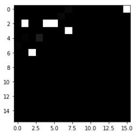
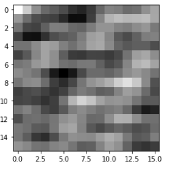

# zigzag-
针对论文《An Effective Preprocess for Deep Learning  Based Intrusion Detection》的复现，其中CNN网络架构为自己搭建
#概述
该论文主要采用之字形编码的方式针对kddcup99数据集进行预处理，原文所述流程如下：
  1.对符号型数据进行数值化，采用独热编码；
  2.对数值化后的数据进行z-score标准化；
  3.对标准化后的数据进行量化，使之分布在[0，255]的区间上；
  4.将数据以之字形填充在[16,16]或[32,32]大小的像素上；
  5.对图片进行逆离散余弦变换（IDCT）；
  6.将图片集送入CNN进行训练。
  
 原文生成图片效果如下所示：
 
 
复现实现效果如下，由于我的示例是16x16图片填充的，所以122个特征显得相对紧凑，且原文对全0的特征列进行了删去处理，复现这里并没有：

#预处理实现
数值化：先用map函数对字符型数据转化为连续数值型数据，再使用onehotencoder进行独热编码，没有使用tf.one_hot的原因是训练的10%数据中，并不完全包含所有特征，可能导致训练出现偏差，同时将标签转化为2分类（normal：0，abnormal：1）；
标准化：直接用map应用sklearn.preprocessing的scale函数；
量化：apply(lambda x: (x-np.min(x))/(np.max(x)-np.min(x))*255 )，对每列（每个特征）应用
