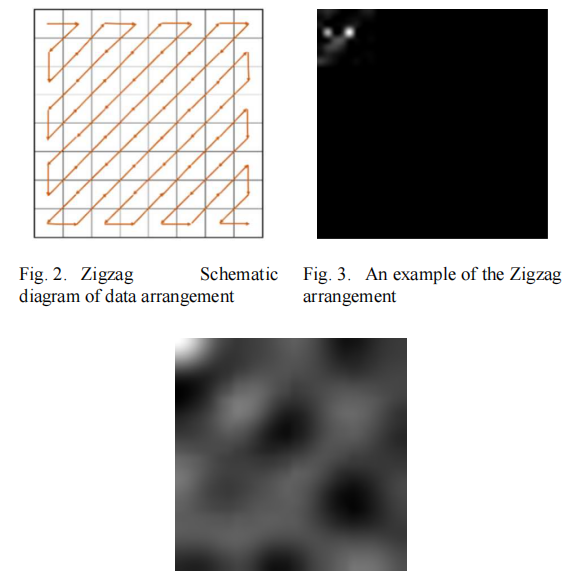

# zigzag-
针对论文《An Effective Preprocess for Deep Learning  Based Intrusion Detection》的复现，其中CNN网络架构为自己搭建

该论文主要采用之字形编码的方式针对kddcup99数据集进行预处理，原文所述流程如下：
  1.对符号型数据进行数值化，采用独热编码；
  2.对数值化后的数据进行z-score标准化；
  3.对标准化后的数据进行量化，使之分布在[0，255]的区间上；
  4.将数据以之字形填充在[16,16]或[32,32]大小的像素上；
  5.对图片进行逆离散余弦变换（IDCT）；
  6.将图片集送入CNN进行训练。
  
 原文生成图片效果如下所示：
 
